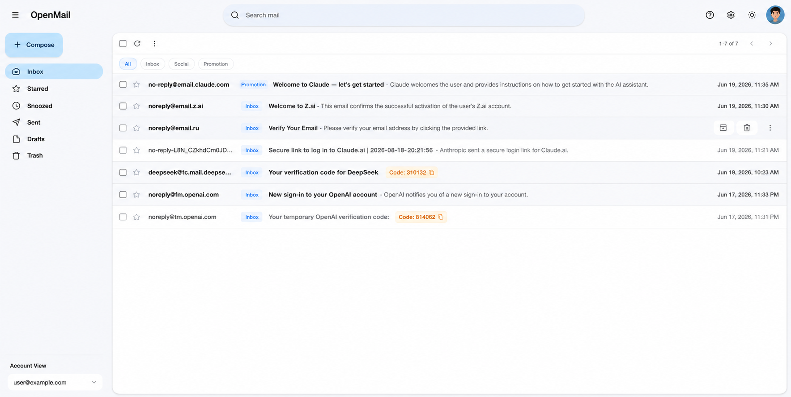
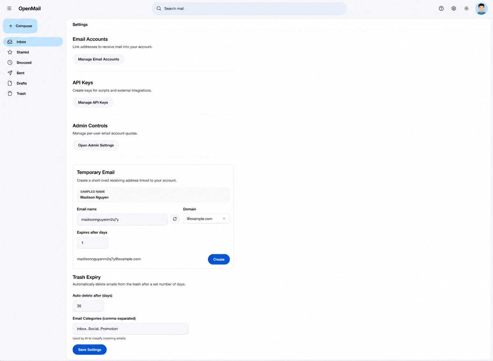
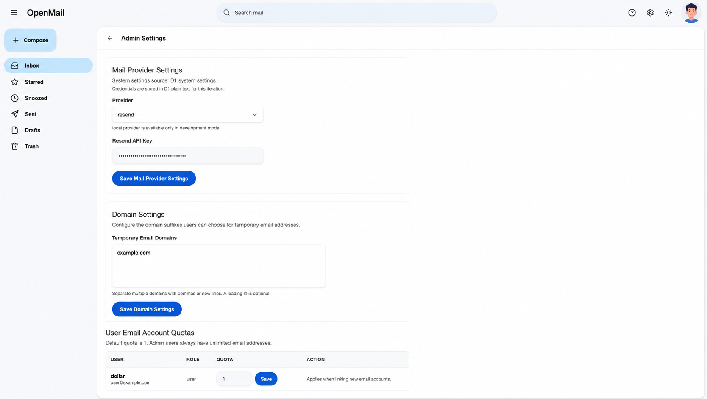

# OpenMail

[](https://nextjs.org/)
[](https://workers.cloudflare.com/)
[](https://www.better-auth.com/)
[](https://pnpm.io/)
[](LICENSE)

OpenMail is an open source email app for receiving, storing, and managing linked email addresses on Cloudflare. It runs a Next.js web app on Cloudflare Workers, receives inbound mail through Cloudflare Email Routing, stores metadata in D1, and keeps raw messages in R2.

<div style="overflow-x: auto; white-space: nowrap;">
  
  
  
</div>

## Features

- Cloudflare-native deployment with Workers, D1, R2, and Email Routing.
- Inbox for linked receiving addresses.
- Outbound email sending via Resend or any SMTP-compatible server.
- Temporary email addresses with Web UI and API support, automatic expiration, and cleanup.
- Raw email storage and viewing for original message inspection.
- Optional Google and GitHub OAuth login.
- Optional email/password login with Resend verification.
- Optional Cloudflare AI classification and summaries for incoming mail.
- Admin settings for domain and mail-provider configuration.
- API keys and REST endpoints to list, read, and delete emails programmatically.
- Rerunnable Cloudflare installer for beginner-friendly setup.

## Documentation

- [Deployment guide](docs/deployment.md): deploy OpenMail to Cloudflare, configure resources, and get provider keys.
- [Config guide](docs/deployment.md#3-which-config-do-you-need): decide which auth, Resend, and Cloudflare AI env vars you need.
- [Usage guide](docs/usage.md): sign in, link addresses, read mail, manage settings, and operate the app.
- [API guide](docs/api.md): API key authentication and mail endpoint documentation.

## Quick Start

Install dependencies:

```bash
pnpm install
```

Run the development server:

```bash
pnpm dev
```

Open [http://localhost:10000](http://localhost:10000) with your browser.

## Deploy

The recommended path is the Cloudflare installer:

```bash
cp .env.example .env.prod
pnpm install:cloudflare:dry-run
pnpm install:cloudflare
```

For the full walkthrough, see [docs/deployment.md](docs/deployment.md).

Quick deploy command for an already configured project:

```bash
pnpm worker:deploy
pnpm email-worker:deploy
```

## Local Cloudflare Preview

Preview the application locally on the Cloudflare runtime:

```bash
pnpm preview
```

## Tech Stack

- Next.js and React for the web app.
- Better Auth for authentication.
- Drizzle ORM with Cloudflare D1.
- Cloudflare R2 for raw email objects.
- Cloudflare Email Routing and a dedicated email worker for inbound mail.
- Tailwind CSS and shadcn-style UI components.

## Contributing

Issues and pull requests are welcome. Before opening a PR, run the relevant checks:

```bash
pnpm build
git diff --check
```

## License

Distributed under the MIT License. See [LICENSE](LICENSE) for more info.
